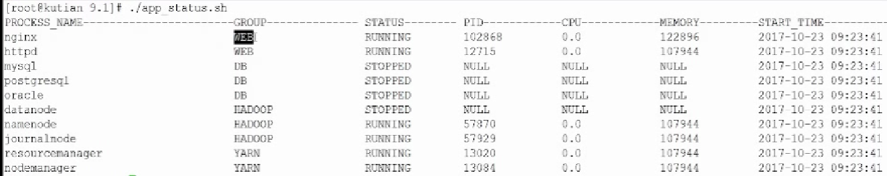

# 实现一个简单进程管理工具
## 案例目录在examples/example6下
### 需求如下
  + 可以查看一批进程，对进程进行分组、也可以查看单个进程
  + 一键关闭这批进程
  + 一键杀掉进程
  + 图如下：
  + 
### 实现思路
  + mock服务(examples/example6/mockServe目录)
    + 通过 tail -f .*.conf 来模拟服务
  + 实现查看进程命令
    +  有如下功能
      + status.sh 可以列出命令有哪些
      + status.sh -g DB 可以查看 DB组下所有进程情况
      + status.sh mysql1 可以查看mysql1服务进程状态
